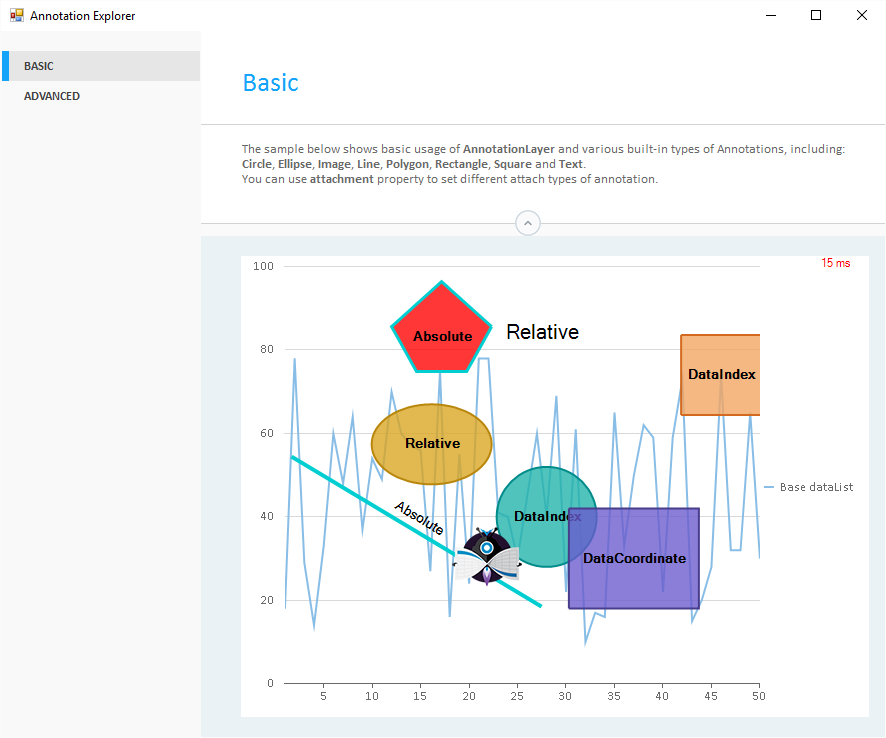

## FlexChart Annotation
#### [Download as zip](https://grapecity.github.io/DownGit/#/home?url=https://github.com/GrapeCity/ComponentOne-WinForms-Samples/tree/master/NetFramework\FlexChart\CS\AnnotationExplorer)
____
#### Shows how to use the AnnotationLayer and various built-in types of Annotations.
____
The sample shows how to display annotations of different shapes, including: Circle, Ellipse, Image, Line, Polygon, Rectangle and Square.

