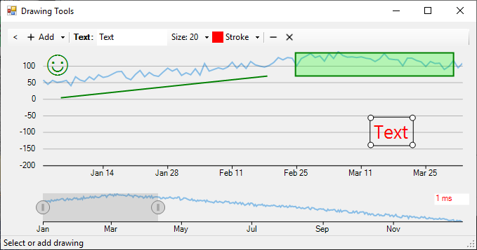

## DrawingTools
#### [Download as zip](https://grapecity.github.io/DownGit/#/home?url=https://github.com/GrapeCity/ComponentOne-WinForms-Samples/tree/master/NetFramework\FlexChart\CS\DrawingTools)
____
#### Shows drawing tools over FlexChart.
____
The sample contains DrawingLayer implementation that can be attached to FlexChart and allows to interactively add and edit chart annotations.
In addition, the layer can be used for any other chart elements, for example moving average trend.

