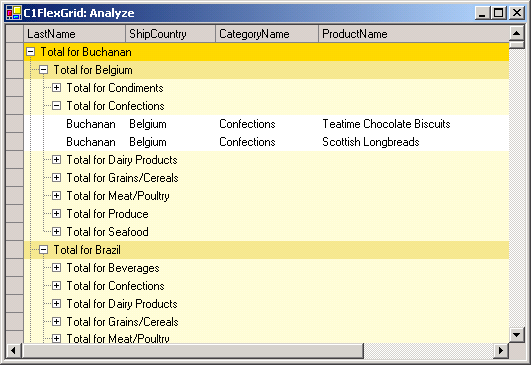

## Analyze
#### [Download as zip](https://grapecity.github.io/DownGit/#/home?url=https://github.com/GrapeCity/ComponentOne-WinForms-Samples/tree/master/NetFramework\FlexGrid\CS\Analyze)
____
#### Provide dynamic data sorting and grouping.
____
The sample allows users to drag columns and instantly re-organizes the data by sorting, totaling, and grouping it.

The subtotals are calculated and displayed as a tree using the Subtotal method.
The BeginUpdate/EndUpdate methods are used to eliminate flicker while different levels of subtotals are calculated.

Here is the code that creates the subtotals whenever the user drags a column to a new position:

```
	// total on 'Sale Amount'
	int totalOn = _flex.Cols["Sale Amount"].Index;
	string caption = "Total for {0}";

    // don't update the screen while calculating the totals
    _flex.BeginUpdate();
            
    // calculate three levels of totals
    _flex.Subtotal(AggregateEnum.Sum, 0, 1, totalOn, caption);
	_flex.Subtotal(AggregateEnum.Sum, 1, 2, totalOn, caption);
	_flex.Subtotal(AggregateEnum.Sum, 2, 3, totalOn, caption);
	_flex.Tree.Show(2);

	// auto-size the grid to accommodate the tree
	_flex.AutoSizeCols(1, 1, 1000, 3, 30, AutoSizeFlags.IgnoreHidden);

    // restore screen updates
    _flex.EndUpdate();
```
The grid is bound to an ADO.NET data source.


