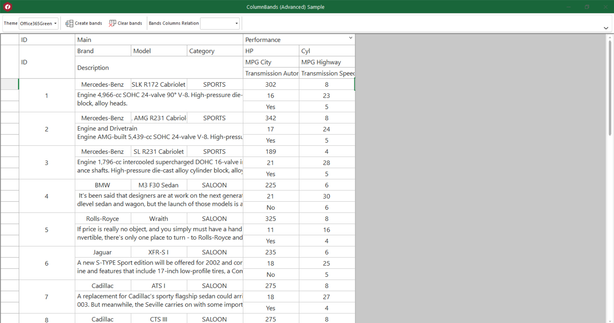

## ColumnBands (Advanced)
#### [Download as zip](https://grapecity.github.io/DownGit/#/home?url=https://github.com/GrapeCity/ComponentOne-WinForms-Samples/tree/master/NetFramework\FlexGrid\CS\ColumnBandsAdvanced)
____
#### This sample shows how to use the new multi row column bands feature in C1FlexGrid.
____
The sample shows how you can control and customize the grid's multi row column bands using the Column Bands editor and from the code.

