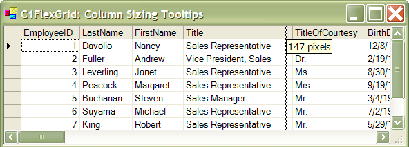

## ColumnWidthTip
#### [Download as zip](https://grapecity.github.io/DownGit/#/home?url=https://github.com/GrapeCity/ComponentOne-WinForms-Samples/tree/master/NetFramework\FlexGrid\CS\ColumnWidthTip)
____
#### Show a tooltip while the user resizes columns.
____
This sample shows how you can implement a tooltip that shows the new column width while the user resizes columns with the mouse (like Excel).

