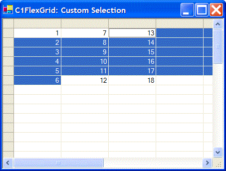

## CustomSelection
#### [Download as zip](https://grapecity.github.io/DownGit/#/home?url=https://github.com/GrapeCity/ComponentOne-WinForms-Samples/tree/master/NetFramework\FlexGrid\CS\CustomSelection)
____
#### Uses OwnerDraw to implement custom (non-rectangular) selection.
____
The sample uses OwnerDraw to highlight cells between the selection anchor (Row, Col) and the selection end (RowSel, ColSel).
This causes the selection to span lines, as in a text editor.

The sample also handles the AfterSelChange to invalidate as few rows as possible to support the custom selection method.
It could simply call Invalidate() instead, but that would be inefficient.

