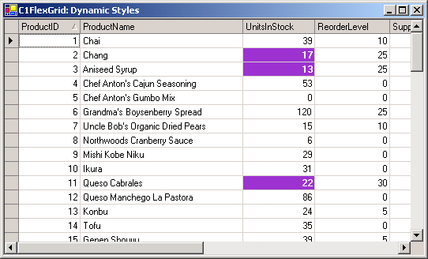

## DBDynamicStyles
#### [Download as zip](https://grapecity.github.io/DownGit/#/home?url=https://github.com/GrapeCity/ComponentOne-WinForms-Samples/tree/master/NetFramework\FlexGrid\CS\DBDynamicStyles)
____
#### Assign styles to grid cells based on their contents.
____
The sample uses OwnerDraw to select the style dynamically, instead of assigning the styles statically to the rows.
This method works better when the grid is bound to a data source and is much faster when the grid has lots of rows.

