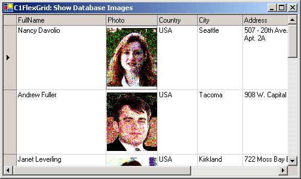

## DBImage
#### [Download as zip](https://grapecity.github.io/DownGit/#/home?url=https://github.com/GrapeCity/ComponentOne-WinForms-Samples/tree/master/NetFramework\FlexGrid\CS\DBImages)
____
#### Bind the grid to a data base with image fields stored as OLE objects.
____
If the data base contains native image fields, no extra work is needed (you can simply bind the grid to the data source).
However, Access stores images as OLE objects, and a little extra work is needed.

