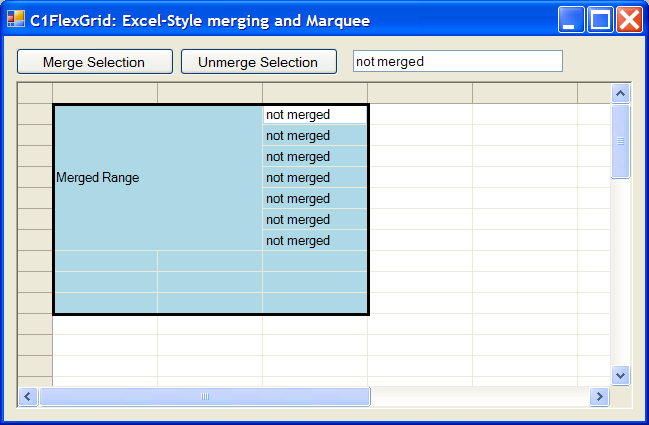

## ExcelStyleMerge
#### [Download as zip](https://grapecity.github.io/DownGit/#/home?url=https://github.com/GrapeCity/ComponentOne-WinForms-Samples/tree/master/NetFramework\FlexGrid\CS\ExcelStyleMerge\ExcelStyleMerge)
____
#### Implement Excel-style merging using AllowMerging = AllowMergingEnum.Custom.
____
The custom merging mode allows you to specify custom ranges to be merged, independently of the cell contents.
This feature can be used to implement Excel-style merging, where the user selects arbitrary ranges that can be merged and unmerged.

Here is the code that adds and removes ranges from the merged range list:

```
  void AddMergedRange(CellRange rng)
  {
    if (!rng.IsSingleCell)
    {
      RemoveMergedRange(rng);
      _flex.MergedRanges.Add(rng);
    }
  }
  void RemoveMergedRange(CellRange rng)
  {
    for (int i = 0; i < _flex.MergedRanges.Count; i++)
    {
      if (RangesIntersect(rng, _flex.MergedRanges[i]))
      {
        _flex.MergedRanges.RemoveAt(i);
        i--;
      }
    }
  }
  static bool RangesIntersect(CellRange rng1, CellRange rng2)
  {
    if (rng1.BottomRow < rng2.TopRow) return false;
    if (rng1.TopRow > rng2.BottomRow) return false;
    if (rng1.RightCol < rng2.LeftCol) return false;
    if (rng1.LeftCol > rng2.RightCol) return false;
    return true;
  }
```
The sample also demonstrates how you can use the Paint event to draw a marquee (solid black rectangle) around the current selection, as Excel does.

Here is the code that draws the marquee:

```
  void _flex_Paint(object sender, PaintEventArgs e)
  {
    // get selection rectangle
    var sel = _flex.Selection;
    var rc1 = _flex.GetCellRect(sel.TopRow, sel.LeftCol);
    var rc2 = _flex.GetCellRect(sel.BottomRow, sel.RightCol);
    var rc = Rectangle.Union(rc1, rc2);

    // draw marquee around the selection
    e.Graphics.DrawRectangle(_marquee, rc);
  }
```

