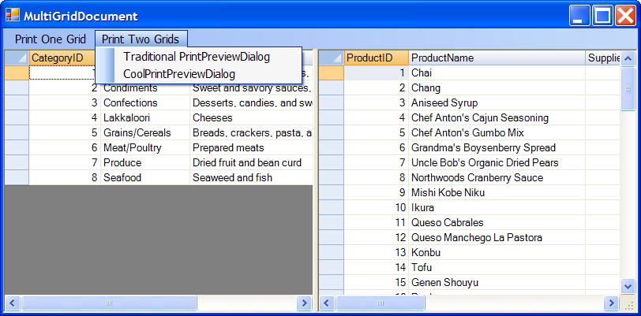

## MultiGridDocument
#### [Download as zip](https://grapecity.github.io/DownGit/#/home?url=https://github.com/GrapeCity/ComponentOne-WinForms-Samples/tree/master/NetFramework\FlexGrid\CS\MultiGridDocument)
____
#### Shows how to render multiple grids into a single PrintDocument.
____
The C1FlexGrid always provided a PrintGrid method which is still available. 
That is the easiest way to print and preview a grid.
For example:

```
private void button1_Click(object sender, EventArgs e)
{
	c1FlexGrid1.PrintGrid("Traditional", 
		PrintGridFlags.FitToPageWidth | 
        PrintGridFlags.ExtendLastCol | 
        PrintGridFlags.ShowPreviewDialog);
}
```
This method automatically creates and prepares a PrintDocument object that contains a single FlexGrid.
But it does not allow you to combine the grid with other content elements on the document, including other grids.

This sample shows how you can use the new PrintDocumentGridRenderer class to render multiple grids into one existing PrintDocument.
All you need to do is create one PrintDocumentGridRenderer for each grid, then call the PrintPage method in response to the PrintDocument's PrintPage event.

The sample also uses a CoolPrintPreviewDialog class that enhances the standard PrintPreviewDialog class to provide faster rendering,
a better looking and more functional UI, and the ability to export the document to PDF.


