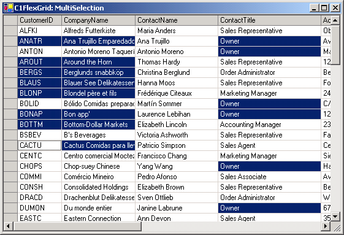

## MultiSelection
#### [Download as zip](https://grapecity.github.io/DownGit/#/home?url=https://github.com/GrapeCity/ComponentOne-WinForms-Samples/tree/master/NetFramework\FlexGrid\CS\MultiSelection)
____
#### Shows how to implement multi-range selection.
____
Depending on the setting of the SelectioMode property, the C1FlexGrid allows the selection of a single arbitrary range, groups of adjacent rows or columns, or arbitrary rows (ListBox mode).

This sample inherits from the grid and adds a new selection mode similar to the one in Excel, where the user can select any number of ranges.
The ranges may be of any size and they don't have to be adjacent.

