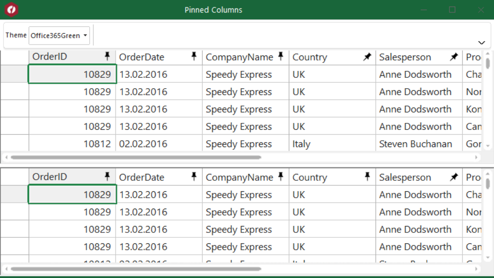

## PinningColumns
#### [Download as zip](https://grapecity.github.io/DownGit/#/home?url=https://github.com/GrapeCity/ComponentOne-WinForms-Samples/tree/master/NetFramework\FlexGrid\CS\PinningColumns)
____
#### This sample shows that C1FlexGrid component support pinning columns.
____
C1FlexGrid supports pinning singe column at time (top sample) or column range (bottom sample).
To allow the user to pin and unpin columns, set AllowPinning property to SingleColumn or ColumnRange.

