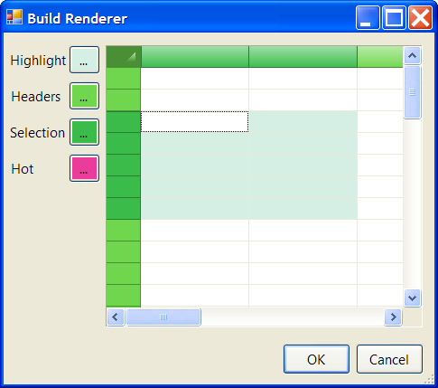

## Renderer
#### [Download as zip](https://grapecity.github.io/DownGit/#/home?url=https://github.com/GrapeCity/ComponentOne-WinForms-Samples/tree/master/NetFramework\FlexGrid\CS\Renderer)
____
#### Shows how to create and use visual styles using the new Renderer property.
____
The C1FlexGrid now exposes a Renderer property, similar to the one available in the ToolStrip control.

Rather than building the grid appearance by setting up many properties in the grid's Styles collection,
the Renderer class allows you to customize the appearance of the grid using a single object.
You can define renderers and share them easily across the enterprise, ensuring a consistent and professional look for your grids.

The Renderer property leverages the rendering engine used to implement the VisualStyle property.
The Renderer property is a C1FlexGridRenderer object, the base abstract type from which all grid renderers inherit.
The C1FlexGrid also provides an easy-to-use GridRendererOffice2007 type which inherits from C1FlexGridRenderer and uses a set of 25 colors to create all the gradients and 
images used to implement the MS Office 2007 visual styles (blue, silver, and black).

The sample shows how you can implement a simpler custom renderer that requires only 5 colors to set up, and results in visually attractive custom visual styles.
Use it to create your own styles such as OfficeGreen or OfficeGold.

