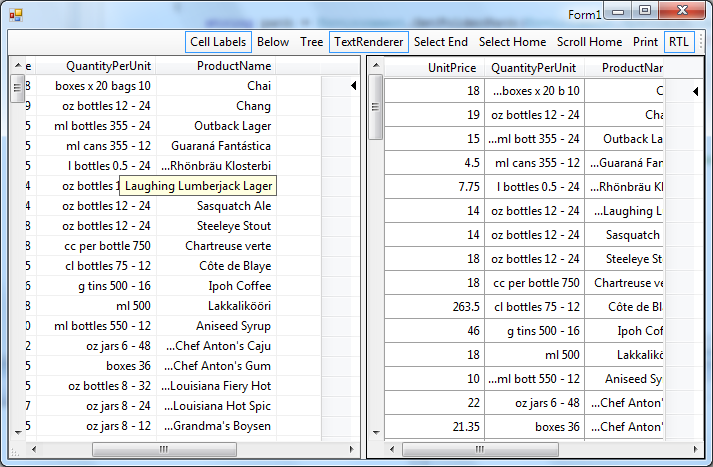

## RightToLeft
#### [Download as zip](https://grapecity.github.io/DownGit/#/home?url=https://github.com/GrapeCity/ComponentOne-WinForms-Samples/tree/master/NetFramework\FlexGrid\CS\RightToLeft)
____
#### Demonstrates the C1FlexGrid support for RightToLeft languages.
____
The sample contains a C1FlexGrid and a DataGridView bound to the same data.

The first button on the toolstrip above the grids sets the RightToLeft property on the form, automatically enabling RightToLeft support on both grids.

Other buttons show the effect of RightToLeft on additional FlexGrid features Subtotals and CellLabels.

