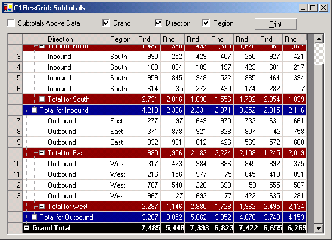

## Subtotals
#### [Download as zip](https://grapecity.github.io/DownGit/#/home?url=https://github.com/GrapeCity/ComponentOne-WinForms-Samples/tree/master/NetFramework\FlexGrid\CS\Subtotals)
____
#### Create subtotals for multiple columns.
____
The sample populates a grid with random data and allows you to add up to three levels of subtotals, either above or below the data.

Each subtotal level is calculated for all data columns.

