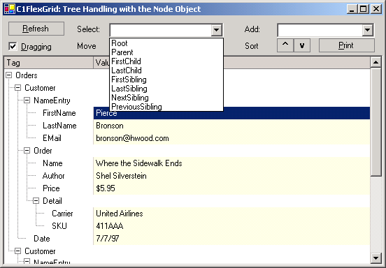

## TreeNode
#### [Download as zip](https://grapecity.github.io/DownGit/#/home?url=https://github.com/GrapeCity/ComponentOne-WinForms-Samples/tree/master/NetFramework\FlexGrid\CS\TreeNode)
____
#### Manage an outline tree using the FlexGrid Node objects.
____
This project shows how you can manage a FlexGrid outline tree using the Node object.
The sample build an outline tree from an XML file, then allows the user to move, select, add, and sort nodes.

