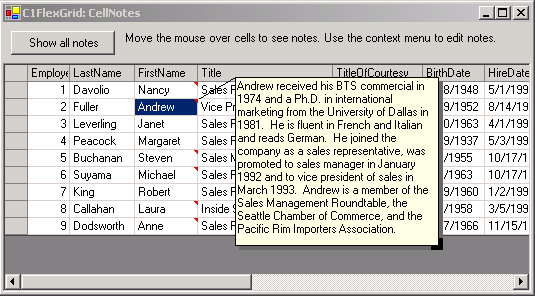

## CellNotes
#### [Download as zip](https://grapecity.github.io/DownGit/#/home?url=https://github.com/GrapeCity/ComponentOne-WinForms-Samples/tree/master/NetFramework\FlexGrid\VB\CellNotes)
____
#### Attach notes to cells on a C1FlexGrid.
____
The sample implements Excel-style cell notes using two classes:

* CellNote. CellNote derives from Form and is used to hold, display, and edit notes. This class is not grid-specific and can be used with other controls.
* CellNoteManager. CellNoteManager connects to a C1FlexGrid control to provide services related to the cell notes (mouse handling, owner draw, and a context menu).

