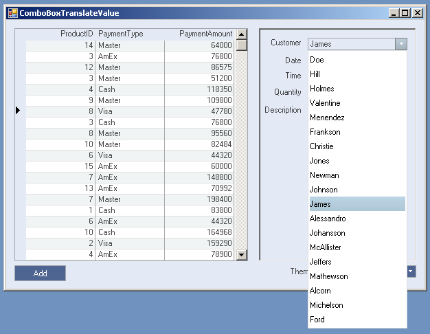

## ComboBoxTranslateValue
#### [Download as zip](https://grapecity.github.io/DownGit/#/home?url=https://github.com/GrapeCity/ComponentOne-WinForms-Samples/tree/master/NetFramework\Input\CS\ComboBoxTranslateValue)
____
#### Demonstrates how to use C1ComboBox.TranslateValue property.
____
This sample shows how to bind C1ComboBox to datesource and translate value to Text using DataSource and TranslateValue properties.
At run time end-user can:

* create new record in grid using "Add" button;
* edit visible fields in grid;
* edit invisible fields using edit form on the right;
* choose application theme using C1ComboBox.
In this sample we have two data tables from the "C1NWind" database:
 1. Customer_demo (ID, LastName + some fields);
 2. Order (customerId + some fields).
Data binding:

* C1ComboBox.Value is bound to the "CustomerID" field from the Order table;
* C1ComboBox items are bound to the "Customer_demo" table and show "LastName" field content.
Setting C1ComboBox.TranslateValue property to true forces C1ComboBox to update text to proper lookup value when SelectedItem is changed.
In this sample it happens every time when end-user selects different data row in the grid.

