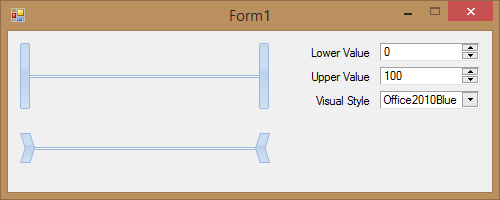

## RangeSliders
#### [Download as zip](https://grapecity.github.io/DownGit/#/home?url=https://github.com/GrapeCity/ComponentOne-WinForms-Samples/tree/master/NetFramework\Input\CS\RangeSliders)
____
#### This sample shows how to use the C1RangeSlider control.
____
There are two C1RangeSlider's on the form.

"Lower Value" C1NumericEdit displays lower value of sliders and "Upper Value" C1NumericEdit displays upper value.
Also C1NumericEdit's are used for control lower and upper values of sliders.
"Visual Style" C1ComboBox is used for changing VisualStyle property of sliders.

The bottom C1RangeSlider uses LowerThumbPath and UpperThumbPath properties to display custom shapes as thumbs of C1RangeSlider.

