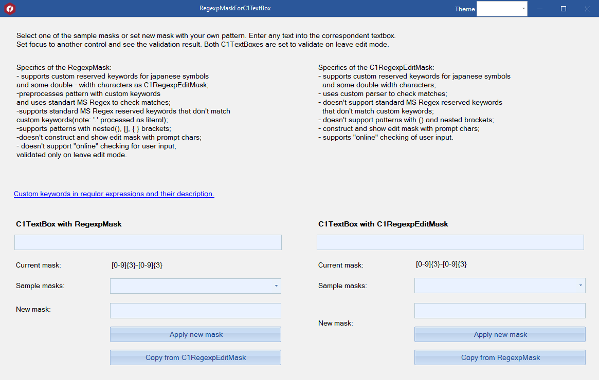

## RegexpMaskForC1TextBox
#### [Download as zip](https://grapecity.github.io/DownGit/#/home?url=https://github.com/GrapeCity/ComponentOne-WinForms-Samples/tree/master/NetFramework\Input\CS\RegexpMaskForC1TextBox)
____
#### The sample allows to compare using RegexpMask based on MS Regex and custom C1RegexpEditMask with C1TextBox.
____
This sample demonstrates RegexpMask based on MS Regex with support of custom keywords for japanese and half-width/double-width symbol groups.

Specifics of the C1RegexpEditMask:
- supports custom reserved keywords for japanese symbols and some double-width characters;
- uses custom parser to check matches;
- doesn't support standard MS Regex reserved keywords that don't match custom keywords;
- doesn't support patterns with () and nested brackets;
- construct and show edit mask with prompt chars;
- supports "online" checking of user input.

Specifics of the RegexpMask: 
- supports custom reserved keywords for japanese symbols and some double-width characters as C1RegexpEditMask;
- preprocesses pattern with custom keywords and uses standart MS Regex to check matches;
- supports standard MS Regex reserved keywords that don't match custom keywords (note: '.' processed as literal);
- supports patterns with nested brackets;
- doesn't construct and show edit mask with prompt chars;
- doesn't support "online" checking for user input, validated only on leave edit mode.

