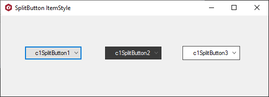

## SplitButtonItemStyle
#### [Download as zip](https://grapecity.github.io/DownGit/#/home?url=https://github.com/GrapeCity/ComponentOne-WinForms-Samples/tree/master/NetFramework\Input\CS\SplitButtonItemStyle)
____
#### SplitButton ItemStyle
____
This sample shows how to use the ItemStyle property. This property provides the style of split button items.

