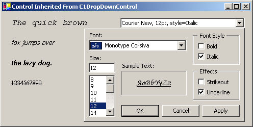

## InheritedDropDown
#### [Download as zip](https://grapecity.github.io/DownGit/#/home?url=https://github.com/GrapeCity/ComponentOne-WinForms-Samples/tree/master/NetFramework\Input\VB\InheritedDropDown)
____
#### Font editor control inherited from C1DropDownControl.
____
The sample implements a fully functional font editing control based on C1DropDrownControl.
The user can change font properties with the text editor or she can open the dropdown portion to change font properties in a more convenient way.
The source code for the control is in the FontEditorControl directory.
There is also a sample demo application using the control in the TestApplication directory.

