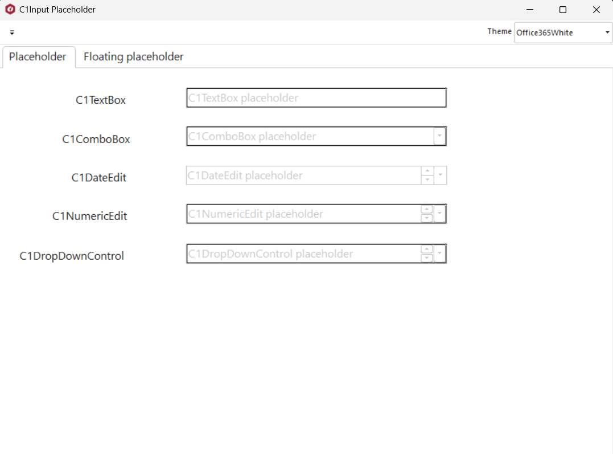

## Placeholder
#### [Download as zip](https://grapecity.github.io/DownGit/#/home?url=https://github.com/GrapeCity/ComponentOne-WinForms-Samples/tree/master/NetFramework\Input\VB\Placeholder)
____
#### The textual place holder.
____
This sample shows how to use the textual place holder, that is displayed by C1Input text editors to prompt the user for information.

