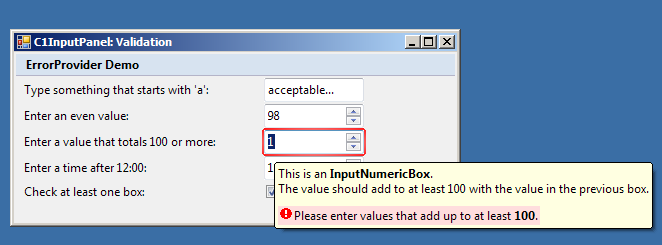

## ErrorProvider
#### [Download as zip](https://grapecity.github.io/DownGit/#/home?url=https://github.com/GrapeCity/ComponentOne-WinForms-Samples/tree/master/NetFramework\InputPanel\CS\ErrorProvider)
____
#### This sample demonstrates error processing and notification on an input panel.
____
In this sample we use the Validating event to retain the input focus in the input component which contains invalid data.
Also, we use the ErrorText property to display visual alert for indicating that a component on an input panel has an error associated with it.

