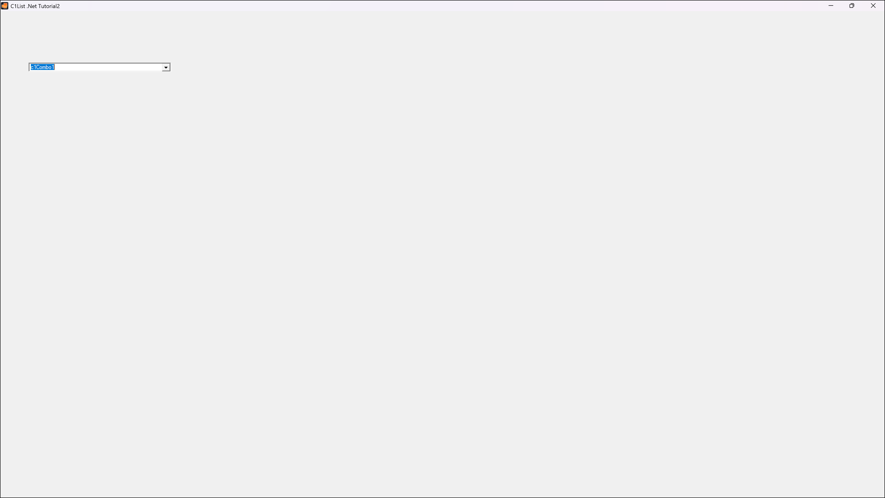

## Tutorial2
#### [Download as zip](https://grapecity.github.io/DownGit/#/home?url=https://github.com/GrapeCity/ComponentOne-WinForms-Samples/tree/master/NetFramework\List\CS\Tutorials\Tutorial2)
____
#### Binding C1Combo to a DataSet.
____
In this tutorial, you will learn how to bind C1Combo to a DataSet.
You will also learn about the basic properties of the C1Combo control.
You will then be able to run the program and observe the run-time features of the combo.

