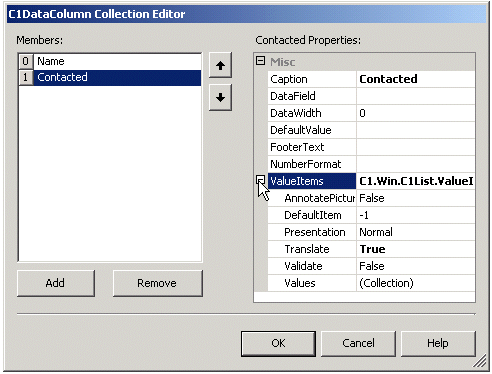

## Tutorial21
#### [Download as zip](https://grapecity.github.io/DownGit/#/home?url=https://github.com/GrapeCity/ComponentOne-WinForms-Samples/tree/master/NetFramework\List\CS\Tutorials\Tutorial21)
____
#### Design-Time Support for C1Combo's AddItem Mode.
____
Design-time support for the AddItem mode of C1List is now available.
The following steps demonstrate how to add items and set a layout at design time.

