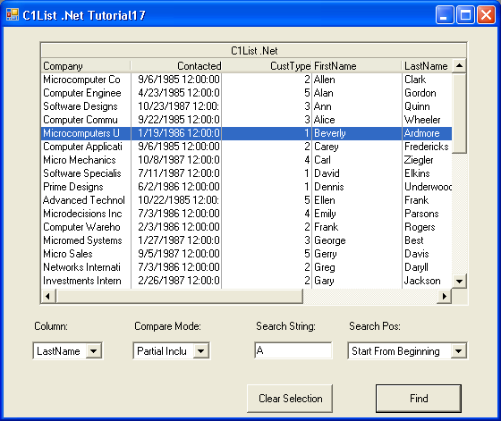

## Tutorial17
#### [Download as zip](https://grapecity.github.io/DownGit/#/home?url=https://github.com/GrapeCity/ComponentOne-WinForms-Samples/tree/master/NetFramework\List\VB\Tutorials\Tutorial17)
____
#### Conduct Searching using the Find Method.
____
In this tutorial you will utilize the Find method in List.
The Find method allows you to perform custom searches within the control.

