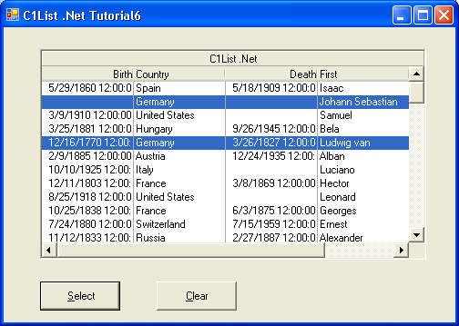

## Tutorial6
#### [Download as zip](https://grapecity.github.io/DownGit/#/home?url=https://github.com/GrapeCity/ComponentOne-WinForms-Samples/tree/master/NetFramework\List\VB\Tutorials\Tutorial6)
____
#### Selecting Multiple Rows Using Bookmarks.
____
In this tutorial, you will learn how to select and highlight records that satisfy specified criteria.
A group of similar items is generally implemented as a collection in C1List.
When manipulating a group of items in C1List, use techniques similar to those described here.

