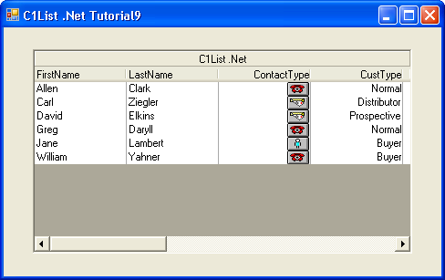

## Tutorial9
#### [Download as zip](https://grapecity.github.io/DownGit/#/home?url=https://github.com/GrapeCity/ComponentOne-WinForms-Samples/tree/master/NetFramework\List\VB\Tutorials\Tutorial9)
____
#### Displaying Translated Data Using Images.
____
In this tutorial, you will learn how to use the Translate and DisplayValue properties to display images in the column.

