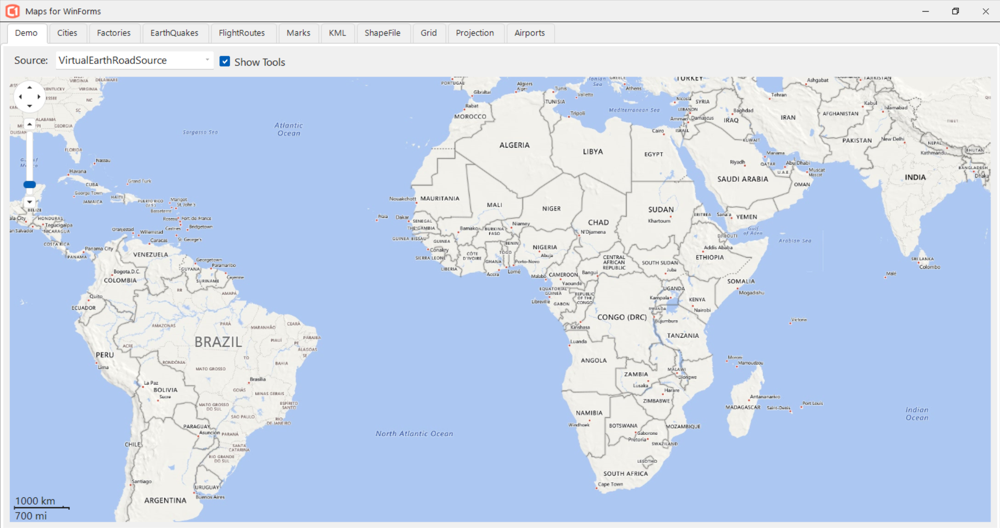

## MapSample
#### [Download as zip](https://grapecity.github.io/DownGit/#/home?url=https://github.com/GrapeCity/ComponentOne-WinForms-Samples/tree/master/NetFramework\Map\CS\MapSample)
____
#### Demonstrates using C1Map control to show tiles and vectors.
____
There is tab control with set of tabs on the Form.
Each tab contains a user control derived from MapUserControl class.
List of the tabs is:

* MapDemo
* MapCities
* MapFactories
* MapEarthQuakes
* MapFlightRoutes

The base MapUserControl can zoom and center.
MapEarthQuakes demonstrates custom shapes drawing.
MapCities, MapGrid and MapFlightRoutes demonstrate vectors.
MapDemo demonstrates tiles.
MapFactories demonstrates both vectors and shapes.

