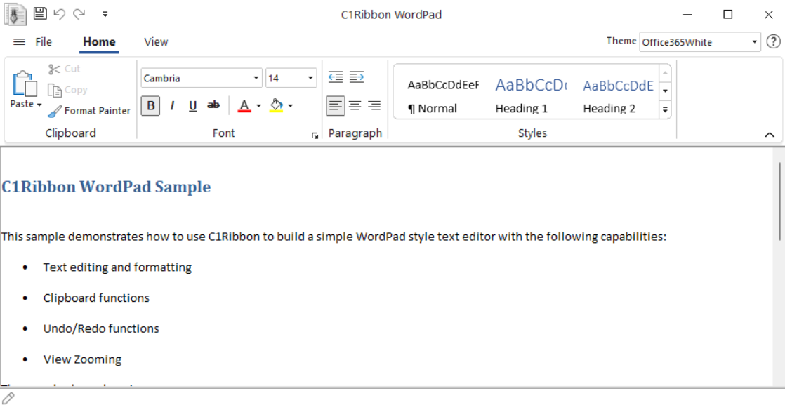

## WordPad
#### [Download as zip](https://grapecity.github.io/DownGit/#/home?url=https://github.com/GrapeCity/ComponentOne-WinForms-Samples/tree/master/NetFramework\Ribbon\VB\WordPad)
____
#### This sample demonstrates how to use C1Ribbon to build a simple Office style text editor.
____
The sample shows how to:

* Populate a RibbonCombobox with names of all fonts installed in the system.
* Manage the input focus so that it goes back to the text area after the user is done using the ribbon.
* Use the RibbonButton.Click event to handle button clicks.
* Use the RibbonCombobox.CommitChanges event.
* Update the Enabled and Pressed properties of RibbonButton based on current text selection.
* Use the application settings to save and retrieve the QAT position.
* Apply themes to the form and Ribbon.
* Build and maintain a list of recent documents; persist the list to application settings.
* Launch a dialog with the Launcher Button of a Ribbon Item Group.

In this sample the ribbon layout has been created entirely with the design time editor.
For an example of how to create or modify the ribbon layout programmatically, see the CreateAppMenu sample.
You can reuse the ribbon groups (or whole tabs) in your own applications using the Load/Save Template command available from the floating toolbars that appear when you click a tab or a group in the designer.

