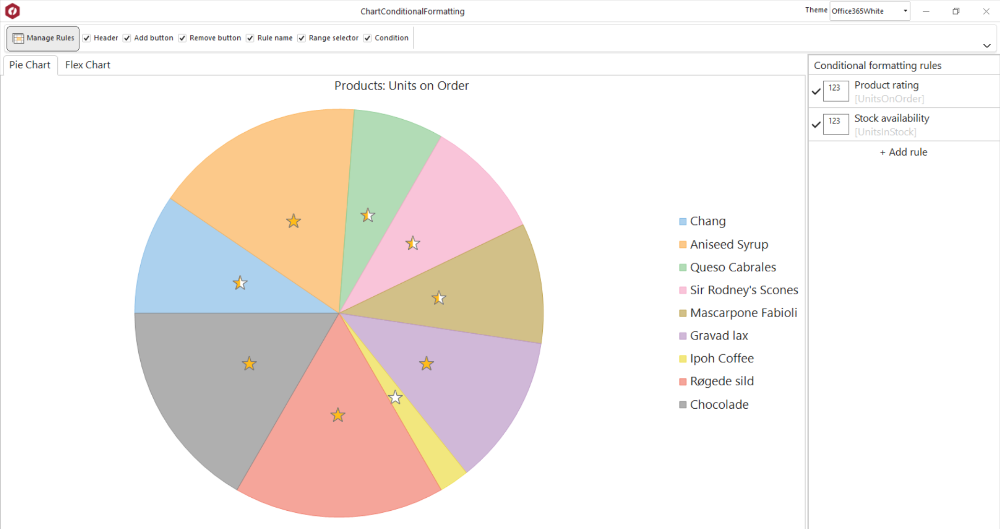

## ChartConditionalFormatting
#### [Download as zip](https://grapecity.github.io/DownGit/#/home?url=https://github.com/GrapeCity/ComponentOne-WinForms-Samples/tree/master/NetFramework\RulesManager\VB\ChartConditionalFormatting)
____
#### This sample shows the basic setup of different chart controls to work with C1RulesManager.
____
Conditional formatting can be used not only with grid controls, but for example with charts.
Implementation of IFormattableView C1RulesManager interface allows to add such possibility.
The sample contains 2 chart controls - FlexChart and FlexPie which implements IFormattableView interface.
Only one C1RulesManager is bound with both controls to show the same data (UnitsOnOrder column of DataTable) in the different representations.
Also not used elements of C1RulesManager UI are hidden.

