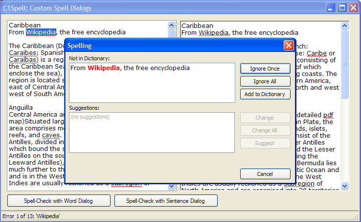

## CustomSpellDialog
#### [Download as zip](https://grapecity.github.io/DownGit/#/home?url=https://github.com/GrapeCity/ComponentOne-WinForms-Samples/tree/master/NetFramework\SpellChecker\CS\CustomSpellDialog)
____
#### Shows how to implement a custom spell-checking modal dialog.
____
The C1SpellChecker control has a built-in modal dialog used to display spelling mistakes and allow users to correct them.

The built-in dialog can be customized in different ways.
For example, you can use the Options.DialogLanguage property to quickly localize dialog.
Or create an instance of the C1SpellDialog class, modify its properties, and then pass that instance in a call to the CheckControl method.

If you need more extensive customization, though, you can create your own spell dialog and use that instead of the built-in one.
This sample shows how to do this. Custom spell dialogs are Form objects that implement the ISpellDialog interface.

