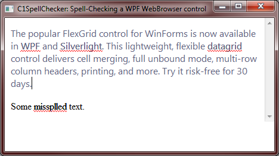

## WpfBrowserControlSpell
#### [Download as zip](https://grapecity.github.io/DownGit/#/home?url=https://github.com/GrapeCity/ComponentOne-WinForms-Samples/tree/master/NetFramework\SpellChecker\CS\WebBrowserSpellWpf)
____
#### Demonstrates how to use C1SpellChecker for .Net 2.0 to check text in a WPF WebBrowser control.
____
The sample shows a WPF WebBrowser control that is run in the edit mode.
To enable spell-as-you-type feature in the WPF WebBrowser control we should get its IWebBrowser2 interface.
This is a little bit tricky but possible.

```
            // Get IWebBrowser2 interface using reflection
            Type t = webBrowser.GetType();
            PropertyInfo pi = t.GetProperty("AxIWebBrowser2", BindingFlags.NonPublic | BindingFlags.Instance);
            object axBrowser = pi.GetValue(webBrowser, null);

            // Use a dummy windows forms control to as the first parameter.
            _spell.SetActiveSpellChecking(new System.Windows.Forms.Label(), axBrowser, true);
```

