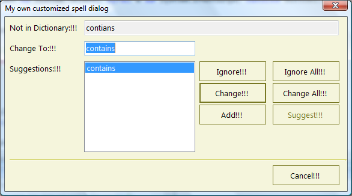

## CustomBuiltInSpellDialog
#### [Download as zip](https://grapecity.github.io/DownGit/#/home?url=https://github.com/GrapeCity/ComponentOne-WinForms-Samples/tree/master/NetFramework\SpellChecker\VB\CustomBuiltInSpellDialog)
____
#### Shows how you can customize the C1SpellChecker's built-in spell dialog.
____
The C1SpellChecker control has a built-in modal dialog used to display spelling mistakes and allow users to correct them.

The sample creates an instance of the C1SpellDialog class, modifies its properties, then passes the customized dialog in a call to the CheckControl method.

