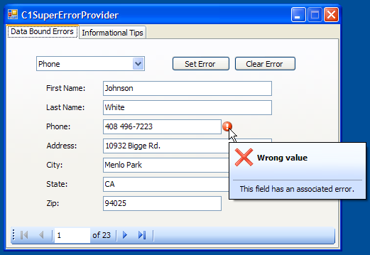

## SuperErrorProvider
#### [Download as zip](https://grapecity.github.io/DownGit/#/home?url=https://github.com/GrapeCity/ComponentOne-WinForms-Samples/tree/master/NetFramework\SuperTooltip\CS\SuperErrorProvider)
____
#### This sample shows how to use the C1SuperErrorProvider component with data sources and individual controls.
____
C1SuperErrorProvider presents a simple mechanism for indicating to the end user that a control or data field/column has an error associated with it.
An icon appears next to the control with not empty error description text.

C1SuperErrorProvider works in conjunction with the C1SuperTooltip component that can display HTML text for the error description.

