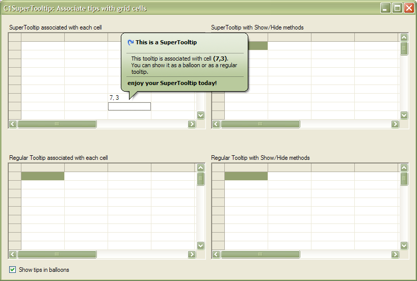

## GridTips
#### [Download as zip](https://grapecity.github.io/DownGit/#/home?url=https://github.com/GrapeCity/ComponentOne-WinForms-Samples/tree/master/NetFramework\SuperTooltip\VB\GridTips)
____
#### Shows two methods that can be used to show SuperTooltips on demand.
____
One method consists of setting the following properties:
1. AutomaticDelay = zero, so tips are shown as soon as the mouse enters the controls (no delay), and
2. AutoPopDelay = int.MaxValue, so tips are not hidden even if the mouse stays over a cell for a long time.

The second method uses the Show() and Hide() methods to display the tooltips on demand.
The sample also shows that both methods can be used either with the C1SuperTooltip or with the standard ToolTip component.
The code is exactly the same for both.

