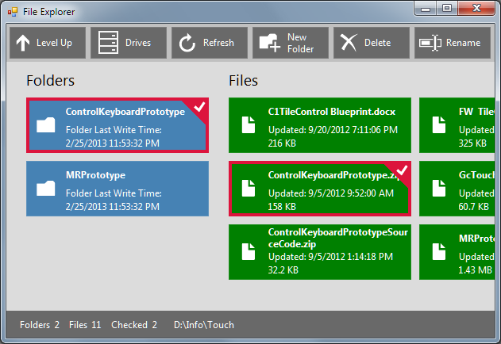

## FileExplorer
#### [Download as zip](https://grapecity.github.io/DownGit/#/home?url=https://github.com/GrapeCity/ComponentOne-WinForms-Samples/tree/master/NetFramework\Tile\VB\FileExplorer)
____
#### The sample allows browsing the files and folders on the local drives.
____
There are two C1TileControl in this sample. One is used as the scrollable toolbar and the other shows individual items, such as drives and folders.
Each type of the item has the special tile template.
For example, the drive's tile template shows a progress bar using the Template.Paint event (to visualize the available space on the drive).

