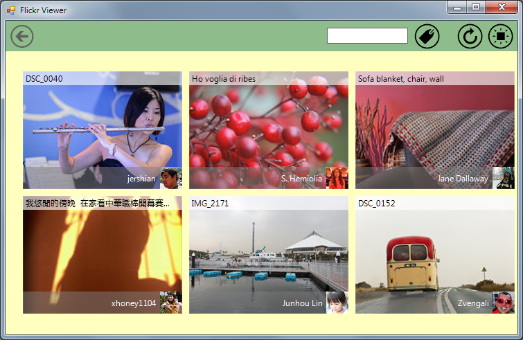

## FlickrViewer
#### [Download as zip](https://grapecity.github.io/DownGit/#/home?url=https://github.com/GrapeCity/ComponentOne-WinForms-Samples/tree/master/NetFramework\Tile\VB\FlickrViewer)
____
#### The sample shows photos from Flickr using C1TileControl.
____
Images are downloaded without blocking the calling thread.
The sample creates the internal queue of requests passed to server one-by-one. Tiles show two images: the thumbnail and the author's avatar (and also some textual info).
When you click the tile it opens large image.

