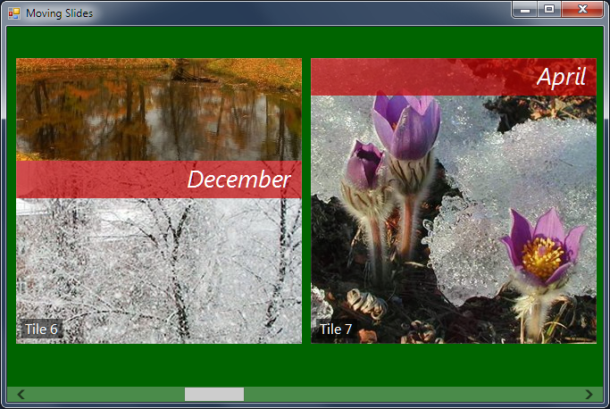

## MovingSlides
#### [Download as zip](https://grapecity.github.io/DownGit/#/home?url=https://github.com/GrapeCity/ComponentOne-WinForms-Samples/tree/master/NetFramework\Tile\VB\MovingSlides)
____
#### The sample demonstrates slides that replace each other using various transitions.
____
Slides are somewhat similar to the same feature of Microsoft PowerPoint.
They show some data for a given amount of time with possible random variation, then switch to another slide using the specified transition.
Transitions may be accelerated or decelerated. You can also define the topmost elements that appear as the fixed layer above all slides.
When you maximize the MovingSlides application the transitions may be not very smooth.
Having too many animated slides that are visible on the same screen may degrade the performance.
Use this feature with caution. You can rearrange tiles in this demo with the mouse or touch interface.

