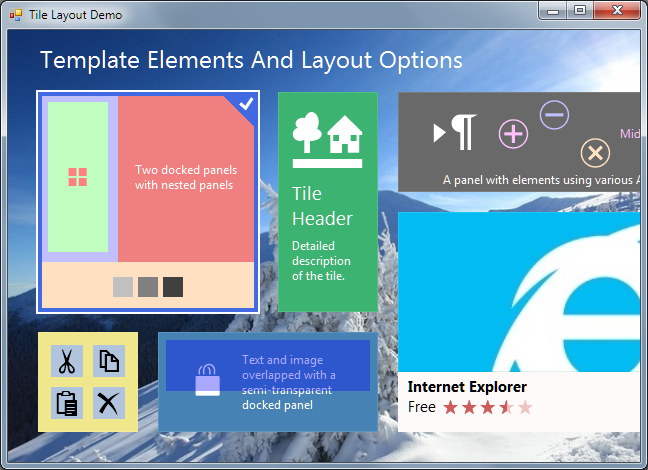

## TileLayout
#### [Download as zip](https://grapecity.github.io/DownGit/#/home?url=https://github.com/GrapeCity/ComponentOne-WinForms-Samples/tree/master/NetFramework\Tile\VB\TileLayout)
____
#### The sample shows various methods of laying out the template elements.
____
Tiles and templates are the most important components of C1TileControl.
Tile provides the data, template provides the visualization pattern.
You can switch templates for the same tile. For example, the first template may show the tile image and the second may show the detailed tile text.
Also, you can apply the same template to multiple tiles.

Templates may consist of three possible elements: panel, text, and image.
Panels may contain child elements including nested panels.
There are a number of layout settings that give you full freedom in laying out the template elements.
The sample shows a few layouts.

