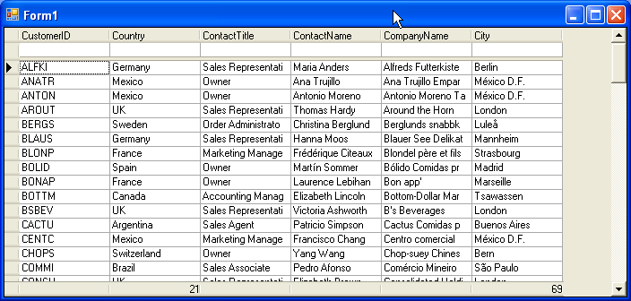

## AggregateFooter
#### [Download as zip](https://grapecity.github.io/DownGit/#/home?url=https://github.com/GrapeCity/ComponentOne-WinForms-Samples/tree/master/NetFramework\TrueDBGrid\CS\AggreGateFooter)
____
#### Using notifications to customize the grids footer.
____
This sample shows how to customize the text for the grids footer.
It attaches a listener to the grid's DataSource and updates the footer text after a change to the filter criteria.
You can also use the same concept if you need to know when the grid has been sorted.

