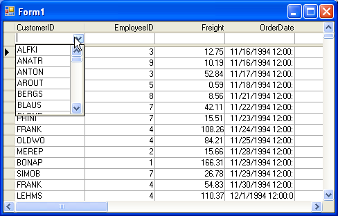

## AutoFilter
#### [Download as zip](https://grapecity.github.io/DownGit/#/home?url=https://github.com/GrapeCity/ComponentOne-WinForms-Samples/tree/master/NetFramework\TrueDBGrid\CS\AutoFilter)
____
#### Using C1TrueDBDropdown in the filter bar.
____
This sample shows how to attach a dropdown to a column programmatically. 
It also shows how to only enable it for the filter bar.

