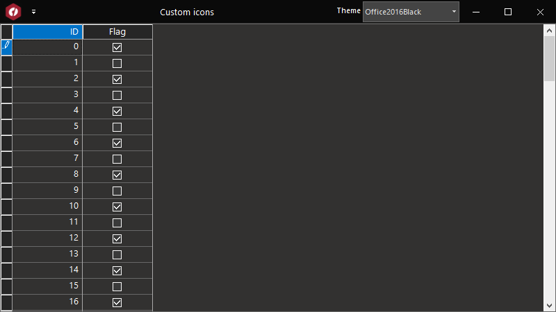

## CustomIcons
#### [Download as zip](https://grapecity.github.io/DownGit/#/home?url=https://github.com/GrapeCity/ComponentOne-WinForms-Samples/tree/master/NetFramework\TrueDBGrid\CS\CustomIcons)
____
#### Custom Icons
____
This sample shows how to use custom icons in the C1TrueDBGrid. You can use the Glyphs property from the Frame class, this property gets the collection of control glyphs (images used to show sorting, check boxes, etc).

