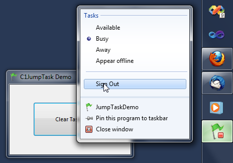

## C1JumpTask Demo
#### [Download as zip](https://grapecity.github.io/DownGit/#/home?url=https://github.com/GrapeCity/ComponentOne-WinForms-Samples/tree/master/NetFramework\Win7Pack\CS\JumpTaskDemo)
____
#### This sample adds the Task category to a custom Jump List.
____
In this sample we add dynamic Tasks to a Jump List.
Typically, tasks are IShellLink items with command-line arguments that indicate particular functionality that can be triggered by an application.
The C1JumpTask class encapsulates the shell interface.
It's pretty easy to manipulate tasks using the C1TaskbarButton component.

