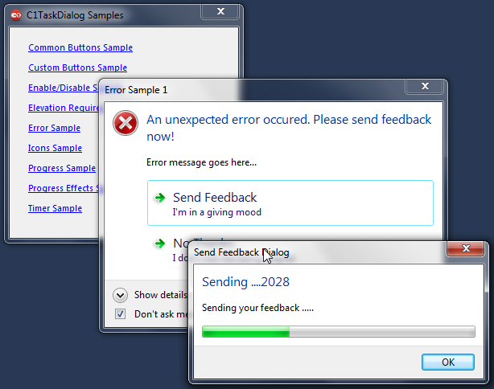

## C1TaskDialog Samples
#### [Download as zip](https://grapecity.github.io/DownGit/#/home?url=https://github.com/GrapeCity/ComponentOne-WinForms-Samples/tree/master/NetFramework\Win7Pack\VB\TaskDialogDemo)
____
#### The sample shows various elements of a task dialog using the C1TaskDialog component.
____
Task dialog is a powerful replacement of the old message box. It consists of several elements, most of which are optional.
The C1TaskDialog component gives an ability to create and adjust task dialogs without much effort.
It works like the common dialogs (OpenFileDialog, for example).
You can set a few properties, then call to the Show() method to display the dialog at run-time.

