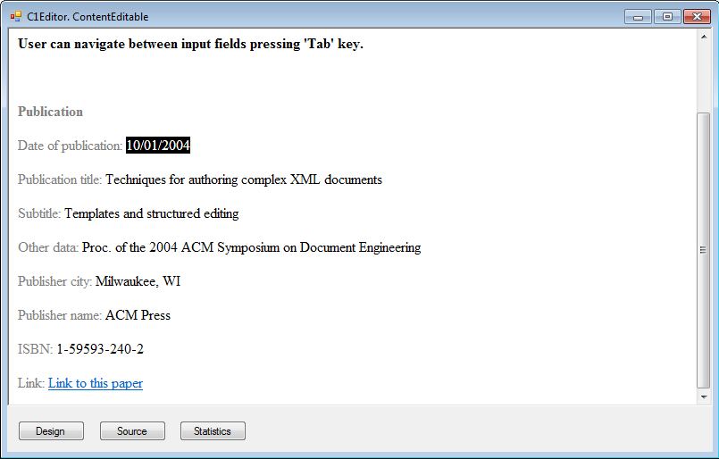

## HtmlEvents
#### [Download as zip](https://grapecity.github.io/DownGit/#/home?url=https://github.com/GrapeCity/ComponentOne-WinForms-Samples/tree/master/NetFramework\XHtmlEditor\CS\HtmlEvents)
____
#### Shows how you can use the HtmlEvent event to control browser elements behavior.
____
You can handle this event, get current browser element and use it in your code.
In this sample, standard Windows controls are used to edit the content of the current browser element when the mouse is over that element.

