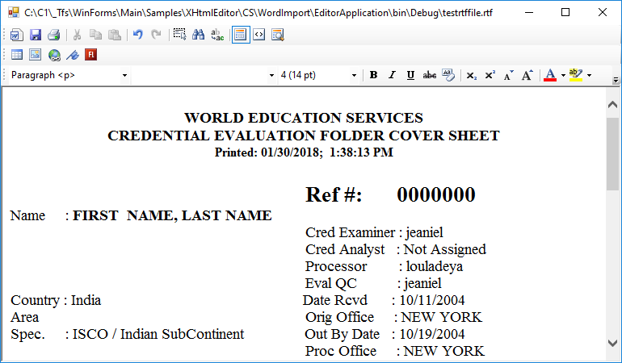

## WordImport
#### [Download as zip](https://grapecity.github.io/DownGit/#/home?url=https://github.com/GrapeCity/ComponentOne-WinForms-Samples/tree/master/NetFramework\XHtmlEditor\CS\WordImport)
____
#### Demonstrates how to create an MS Offic interop-based extension to load .rtf, .docx, .doc in C1Editor.
____
This sample contains two projects:

* EditorApplication - C1Editor-based application which uses the extension to load MS Word files.
* WordImport - the "LoadWord" extension method which utilizes MS Word via interop and uses clipboard to pass the document to C1Editor.

Prerequisites: Microsoft Office 2013 or later must be installed on the system in order to have this sample working.

