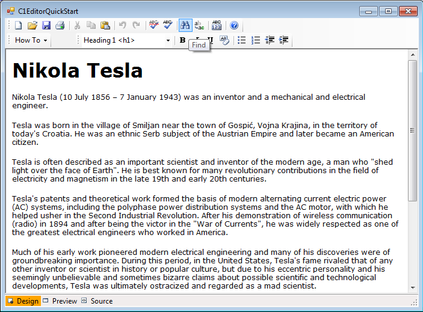

## C1EditorQuickStart
#### [Download as zip](https://grapecity.github.io/DownGit/#/home?url=https://github.com/GrapeCity/ComponentOne-WinForms-Samples/tree/master/NetFramework\XHtmlEditor\VB\C1EditorQuickStart)
____
#### Shows how to implement a basic text editor application using the C1Editor control.
____
The sample implements ToolStrip controls with basic formatting commands attached to a C1Editor.
It also implements menus with commands that perform basic tasks such as text selection and search/replace functions.

