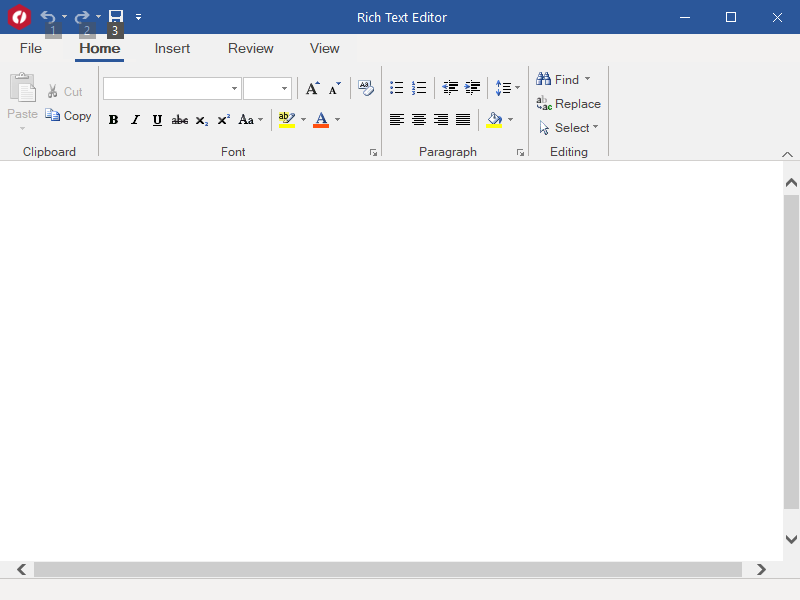

## RichTextEditor
#### [Download as zip](https://grapecity.github.io/DownGit/#/home?url=https://github.com/GrapeCity/ComponentOne-WinForms-Samples/tree/master/NetFramework\XHtmlEditor\VB\RichTextEditor)
____
#### Shows a rich text editor built with the C1Editor control.
____
This sample shows how you can use the C1Editor control to build a rich text editor.

The sample uses C1Ribbon to implement formatting, search and replace, tables, images, spell-checking, PDF export, and other advanced text editing features of the C1Editor control.

